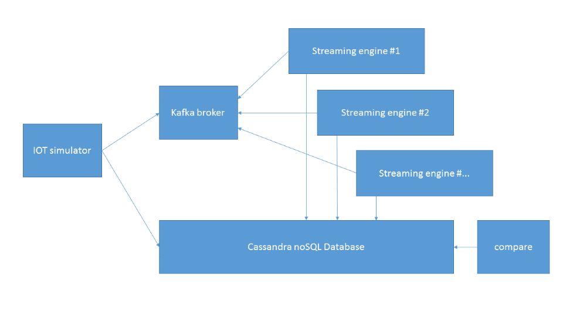

# boontadata - Streams

## Introduction

An IOT devices simulator sends data to Kafka broker. It also writes its version of the truth to a Cassandra database. 

Stream engines (Spark Streaming, Flink, Kafka Streams, Storm, etc.) consume data from the broker and write their version of the truth to the same Cassandra database.

Some code compares the results between the simulator's version of the truth and the stream engines versions.  

The goals are to have code that shows how to do with different frameworks, compare the capabilities of different engines.

Additional goals include comparing performances, resilience to node failures, ...

[... more](doc/scenario.md)

## In which state is the project right now

As you can see in the code folder, we have some code (mostly Python) we should be able to publish soon in this repo. 
For now, an injector sends data to Kafka. It may send duplicates, send out of order, or send late. 
The injector also aggregates what it sent and saves its version of the truth to Cassandra.
One injector simulates one device. You can use several instances to simulate several devices. 
Compare.py compares what the injector sent from a device time and a send time perspective. 

Then, Spark streaming will be the first stream processing engine. It will aggregate using processing time.
For now, it just consumes events from Spark and runs ... Word Count. Obviously this is the first thing that will be replaced, 
in order to aggregate, based on processing time. 

Very simple stuff to start.

Once the initial code is released, the rest of the development will be done in this public repo. 

## Contribute

This is, and will be, a work in progress. 
If you are interested in contributing, please tweet us [@boontadata](https://twitter.com/@boontadata) or just leverage GitHub!

## Why boontadata? 

You may want to search for ["Boonta Eve Classic"](https://www.bing.com/search?q=boonta+eve+classic).
