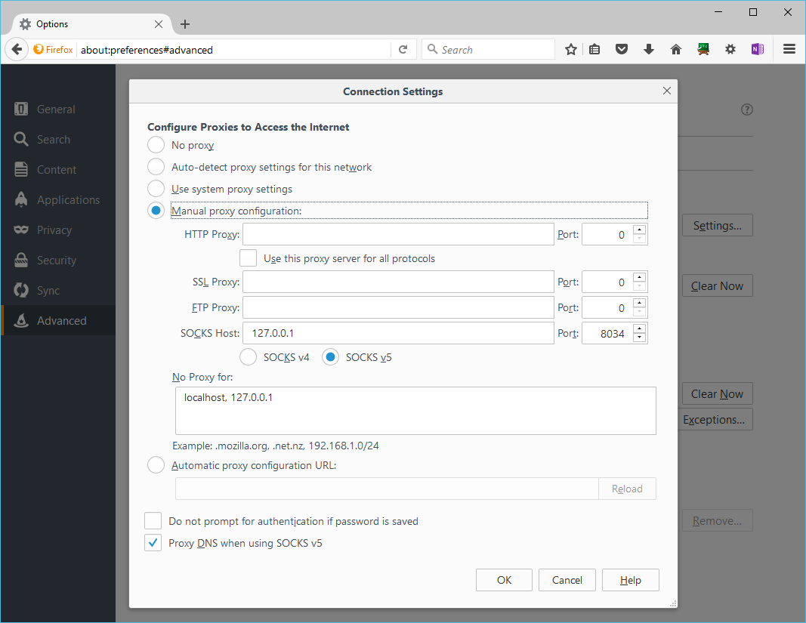

# PyParis 2017

Title: Program in Python against big data clusters from one VM, thanks to Docker

Abstract: You want to develop in Python against big data clusters but you don’t want to run a whole infrastructure? During this workshop, we’ll run boontadata samples starting from a blank Virtual Machine, with clusters like Apache Kafka, Cassandra, Spark or Flink for instance. 

Date and duration: 13-JUN-2017, 90 minutes

This folder contains the material prepared for this workshop. 

## Prerequisites

You can follow the tutorial by just watching or you can do it with the speaker. 
If you choose the second option, you need to be prepared. Here are the prerequistes.

We'll work on an Ubuntu machine that has ~12GB of RAM. The scenarios we'll run typically consume ~8.5 GB of RAM.

You'll also need to bring your laptop with an HTML 5 browser and an ssh client. 


## Agenda

Duration (min) | What | Comments
--------------:|------|----------
10 | Introduction |
20 | Prepare the VM and install Docker | includes Azure subscription creation if needed
20 | Create my first docker-compose infrastructure | 
20 | Get and run boontadata | get sources form git, run 2 different topologies, docker exec into nodes, ssh tunnel to have the UI fo some frameworks like Spark
15 | Additional Python coding | Take some sample code and run it against Spark cluster
5 | Conclusion

## Introduction

## Prepare the VM and install Docker

Explanations will be done on an Azure VM running Ubuntu LTS 16.04. 

Equivalent steps could also be followed on other clouds. You may also run the same on your laptop if it has some RAM and supports Docker. 

If you don't have an Azure subscription a code can be provided to you. You can follow the following documentation: [
How to create an Azure PASS subscription and an organizational account at the same time](https://github.com/DXFrance/data-hackathon/blob/master/doc/AzurePASSorg.md)

Then, [create an Azure VM](createAzureVM.md). The one we create here has 14 GB of RAM, and 2 cores. It's running Ubuntu 16.04.2 LTS.

[Install docker in the VM](installDocker.md). 

## get files from git

From the VM

```bash
cd ~/
git clone https://github.com/boontadata/boontadata-streams.git
export BOONTADATA_HOME=$HOME/boontadata-streams
export BOONTADATA_DOCKER_REGISTRY=boontadata.local
cd $BOONTADATA_HOME
git checkout pyparis2017
```

## Create my first docker-compose infrastructure

From the VM

```bash
cd $BOONTADATA_HOME/workshops/PyParis2017
cd simpleinfra
```

In order to familiarize ourselves with the basics of Docker, we'll create a small 3-node infrastructure and play with it.

Inspect files in the `simpleinfra` folder.

build a Docker image from the current folder (the one where you have the `Dockerfile` file):

```bash
docker build -t pyp17image1 .
```

build a second image based on the same sources
```bash
docker build -t pyp17image2 .
```

this second build took no time because it leveraged cache from the first build. See, the ids are the same for both images:
```bash
docker images
```

start the infrastructure, and list the running nodes

```bash
docker-compose up -d
docker-compose ps
```

connect to node 1: 
```bash
docker exec -ti n1 /bin/sh
```

from node 1 issue a few commands:
```bash
ls -als
./hw.sh
ping -c 4 n2
ping -c 4 n3
```

Then disconnect from node 1 (^D), and shutdown the infrastructure

```bash
docker-compose down
```

## run boontadata

From the VM

```bash
cd $BOONTADATA_HOME/code
```

```bash
. buildimages.sh noreset pullfromdockerhub
```

Pull from an Azure VM takes about 5 to 7 minutes

while it's pulling images and starting you can inspect the following files in the `code` directory: 
- pyclientbase/Dockerfile
- pyclient\Dockerfile
- pyclient\ingest.py
- pyclient\compare.py

```bash
. startscenario.sh flink
docker-compose ps
```

open a tunnel 
```bash
ssh -D 127.0.0.1:8034 $pyp17vmname.westeurope.cloudapp.azure.com
```

then have your browser using the ssh tunnel as a proxy. Here is how this looks in Firefox (which as proxy settings independant of the OS):


and browse to <http://http://0.0.0.0:34010/> where you should see the Flink Web UI. You should be able to locate the `34010`port in the docker-compose.yml file that was generated when you ran `startscenario.sh`.

When `docker-compose ps` shows that all nodes are up except cinit which should have exited with a code of 0, 

```
              Name                               Command                              State                               Ports
---------------------------------------------------------------------------------------------------------------------------------------------
cassandra1                          /docker-entrypoint.sh cass ...      Up                                  0.0.0.0:34060->7000/tcp,
                                                                                                            0.0.0.0:34061->7001/tcp,
                                                                                                            0.0.0.0:34062->7199/tcp,
                                                                                                            0.0.0.0:34063->9042/tcp,
                                                                                                            0.0.0.0:34064->9160/tcp
cassandra2                          /docker-entrypoint.sh cass ...      Up                                  0.0.0.0:34070->7000/tcp,
                                                                                                            0.0.0.0:34071->7001/tcp,
                                                                                                            0.0.0.0:34072->7199/tcp,
                                                                                                            0.0.0.0:34073->9042/tcp,
                                                                                                            0.0.0.0:34074->9160/tcp
cassandra3                          /docker-entrypoint.sh cass ...      Up                                  0.0.0.0:34080->7000/tcp,
                                                                                                            0.0.0.0:34081->7001/tcp,
                                                                                                            0.0.0.0:34082->7199/tcp,
                                                                                                            0.0.0.0:34083->9042/tcp,
                                                                                                            0.0.0.0:34084->9160/tcp
cinit                               /docker-entrypoint.sh /dat ...      Exit 0
client1                             init                                Up
flink-master                        /opt/flink/bin/start-master.sh      Up                                  0.0.0.0:34011->6123/tcp,
                                                                                                            0.0.0.0:34010->8081/tcp
flink-worker1                       /opt/flink/bin/start-worker.sh      Up                                  0.0.0.0:34012->6121/tcp,
                                                                                                            0.0.0.0:34013->6122/tcp
flink-worker2                       /opt/flink/bin/start-worker.sh      Up                                  0.0.0.0:34014->6121/tcp,
                                                                                                            0.0.0.0:34015->6122/tcp
ks1                                 start-kafka.sh                      Up                                  0.0.0.0:34001->9092/tcp
ks2                                 start-kafka.sh                      Up                                  0.0.0.0:34002->9092/tcp
ks3                                 start-kafka.sh                      Up                                  0.0.0.0:34003->9092/tcp
zk1                                 /bin/sh -c /usr/sbin/sshd  ...      Up                                  0.0.0.0:34050->2181/tcp,
                                                                                                            0.0.0.0:34053->22/tcp,
                                                                                                            0.0.0.0:34051->2888/tcp,
                                                                                                            0.0.0.0:34052->3888/tcp
```


you can run one of the Flink scenarios: 

```bash
. runscenario.sh flink2
```

In an automated way, this does the following: 
- run `ingest.py` from the `client1` node. It writes to the Kafka cluster and the Cassandra cluster.
- wait for the Flink job to consume data from Kafka
- kill the Flink job
- run `compare.py` from the `client1` node that compares data inserted by the Flink job and from the `ingest.py` code.

kill the infrastructure, we'll start one with Spark instead of Flink

```bash
docker-compose down
```

```bash
. startscenario.sh spark
docker-compose ps
```

We could run boontadata scenarios like spark1, but we will rather try some pySpark code against the Spark cluster.

## Additional Python coding

You can view the Spark cluster UI at <http://0.0.0.0:34110/>.
The Spark worker UIs are at <http://0.0.0.0:34126/> and <http://0.0.0.0:34136/>.

```bash
docker exec -ti sparkw1 /bin/bash
```

from the spark worker 1 node, run the following:

```bash
bin/pyspark --master spark://sparkm1:7077 --num-executors 2
```

you are in the interactive PySpark shell

Copy/paste or type the following code:

```py
from random import random
from operator import add

spark = SparkSession \
    .builder \
    .appName("PythonPi") \
    .getOrCreate()
```

You can see the application running in the Web UIs.

then run a PI estimation:

```py
partitions = 2
n = 10000000 * partitions

def f(_):
    x = random() * 2 - 1
    y = random() * 2 - 1
    return 1 if x ** 2 + y ** 2 <= 1 else 0

count = spark.sparkContext.parallelize(range(1, n + 1), partitions).map(f).reduce(add)
print("Pi is roughly %f" % (4.0 * count / n))
```

check the web UIs

Stop the application

```py
spark.stop()
```

disconnect from PySpark interactive session (^D), and from the Spark worker node (^D).

## Conclusion

In order to cleanup, you can `docker-compose down` and shut down the VM.

On Azure, you can also completely remove the resources by deleting the resource group from the portal or from the cloud shell (`az group create --name $pyp17rg`).

during this worskhop, we saw how to have Big Data clusters running thru Docker in one VM and how to run Python code against those clusters, both in automated and interactive ways.
