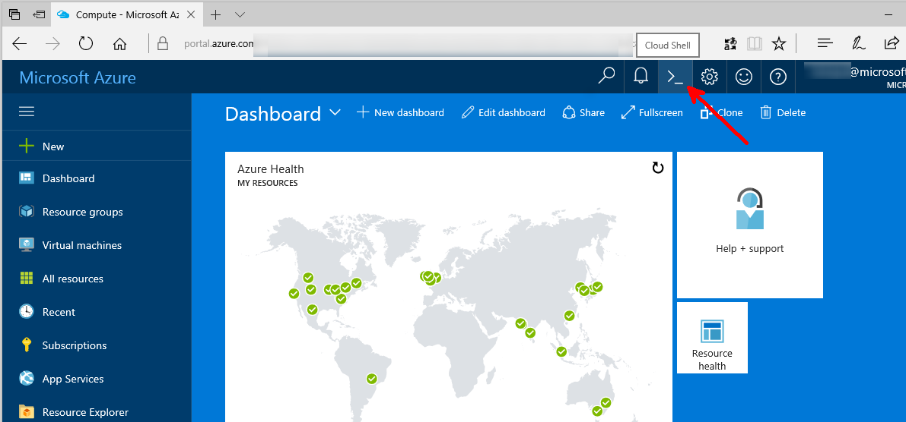

# create an Azure VM

Open the portal: <https://portal.azure.com>

Click on the Cloud Shell Icon: 



This will open a command shell in the browser with the `az` command line available. 

BTW, this az CLI is written in Python. Source code is available here: <https://github.com/azure/azure-cli>.

Locally create an SSH keypair if you don't have one already.

```bash
ssh-keygen -f pyp17
```

this will generate 2 files: `pyp17` and `pyp17.pub`. You will need the content of `pyp17.pub` for the VM creation. 


Edit the first variables of this script with your own values, then copy, paste and execute this code in the Cloud Shell. 

```bash
#!/bin/bash

pyp17rg=pyp17rg
pyp17pubkey="`cat pyp17.pub`" # or your own key
pyp17user=myuser
pyp17vmname=mypyp17vm

# Create a resource group.
az group create --name $pyp17rg --location westeurope

# create the VM itself
az vm create --name pyp17VM --public-ip-address-dns-name $pyp17vmname --resource-group $pyp17rg --image UbuntuLTS --admin-username $pyp17user --ssh-key-value "$pyp17pubkey" --storage-sku Standard_LRS --size Standard_D11_v2_Promo
```

NB: if you want to explore the az CLI operations interactively, try `az interactive`.

Once the VM is created, you should be able to connect from the environment where you created the SSH keypair: 

```bash
ssh $pyp17user@$pyp17vmname.westeurope.cloudapp.azure.com
```

or

```bash
ssh -i pyp17 $pyp17user@$pyp17vmname.westeurope.cloudapp.azure.com
```
